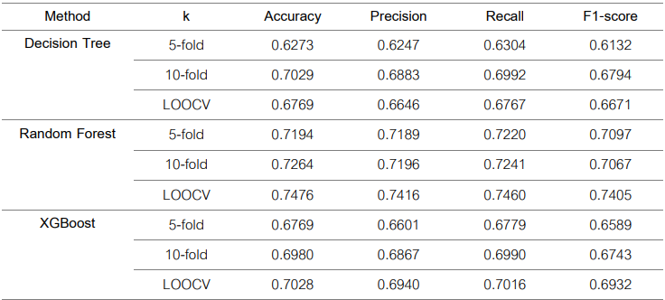
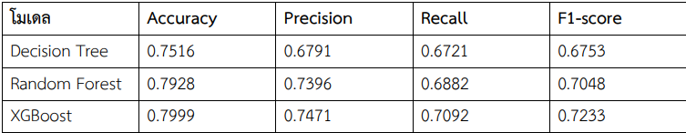
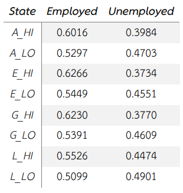
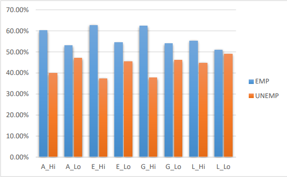
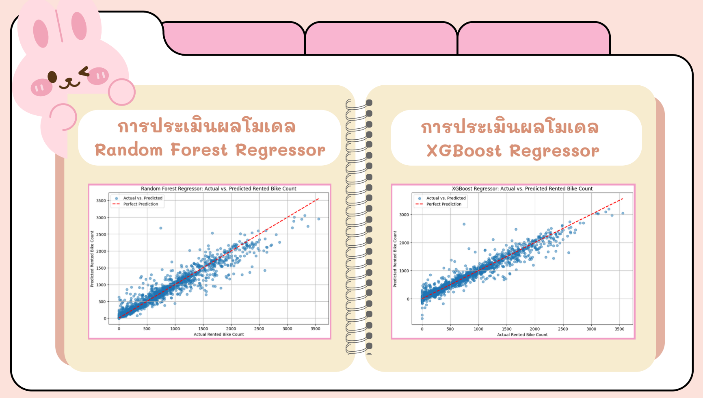
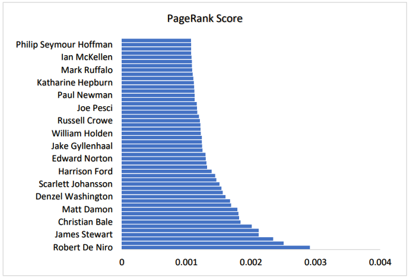
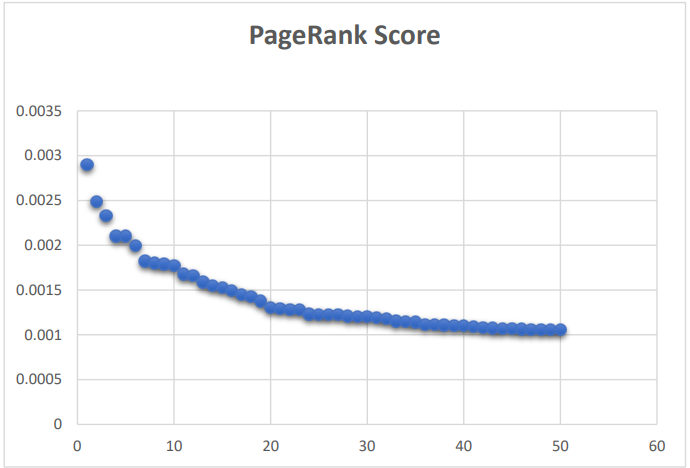

# Welcome to my portfolio website.
---
# Education
---
Kasetsart University (Graduated April 2026) 
Bachelor of Science in Statistics 
Cumulative GPA: 3.44/4.00 (Second-Class Honors) 

---
# Skills
---
- **Technical Skills:** Excel (Formulas, Pivot Tables, Power Pivot, Solver, Data Analysis, VBA), Power BI (Dashboard Development, Data Visualization), SQL (JOIN, GROUP BY, Query optimization, Data cleaning), Python (Pandas, NumPy, scikit-learn), Statistical Tools (R Studio, SPSS, SAS, Minitab) 
- **AI-assisted data analysis:** Using LLMs (e.g., ChatGPT, Gemini, Claude) for data cleaning, exploratory analysis, feature engineering, and workflow automation 
- **Soft Skills:** Analytical Thinking, Problem-Solving, Communication, Adaptability 
- **Languages:** Thai (native), English (Intermediate) 

---
# Experience
---
## Business Operations Assistant (Family Business) | 2025

- Managed sales transactions and maintained data accuracy using POS systems
- Analyzed sales and operational data using Excel to identify trends, customer behavior, and product performance
- Supported inventory planning by monitoring stock levels and sales patterns
- Evaluated revenue, cost, and profit data to generate business insights for decision-making
- Performed basic sales trend analysis and forecasting to support inventory management
- Assisted in day-to-day business operations and reporting processes

---
# Featured Projects
---
# Insurance Premium Calculation using VBA

- Developed an automated insurance premium calculation system using VBA in Microsoft Excel
- Designed calculation logic based on customer and insurance-related factors
- Reduced manual calculation processes and improved calculation accuracy
- Created an interactive Excel interface for user input and automated result generation
- Applied VBA scripting to automate data processing and premium calculations

# Exercise Type Classification using Machine Learning Techniques

- Developed machine learning models to classify exercise types based on personal, health, and economic factors
- Collected and analyzed 424 questionnaire responses from Kasetsart University participants
- Implemented Decision Tree, Random Forest, and XGBoost classification models
- Evaluated model performance using 5-Fold, 10-Fold, and Leave-One-Out Cross Validation
- Compared models using Accuracy, Precision, Recall, and F1-Score metrics
- Random Forest achieved the best overall classification performance

# Customer Churn Prediction using Machine Learning

[](https://github.com/KitipatWararungsriroj/kitipatwr.github.io/blob/d25a279d3abd7b0848513619a2a52f12fe1e233e/files/%E0%B8%81%E0%B8%B2%E0%B8%A3%E0%B8%97%E0%B8%B3%E0%B8%99%E0%B8%B2%E0%B8%A2%E0%B8%81%E0%B8%B2%E0%B8%A3%E0%B8%A2%E0%B8%81%E0%B9%80%E0%B8%A5%E0%B8%B4%E0%B8%81%E0%B8%81%E0%B8%B2%E0%B8%A3%E0%B9%83%E0%B8%8A%E0%B9%89%E0%B8%9A%E0%B8%A3%E0%B8%B4%E0%B8%81%E0%B8%B2%E0%B8%A3%E0%B8%82%E0%B8%AD%E0%B8%87%E0%B8%A5%E0%B8%B9%E0%B8%81%E0%B8%84%E0%B9%89%E0%B8%B2%E0%B8%82%E0%B8%AD%E0%B8%87%E0%B8%9C%E0%B8%B9%E0%B9%89%E0%B9%83%E0%B8%AB%E0%B9%89%E0%B8%9A%E0%B8%A3%E0%B8%B4%E0%B8%81%E0%B8%B2%E0%B8%A3%E0%B9%82%E0%B8%97%E0%B8%A3%E0%B8%A8%E0%B8%B1%E0%B8%9E%E0%B8%97%E0%B9%8C%E0%B8%A1%E0%B8%B7%E0%B8%AD%E0%B8%96%E0%B8%B7%E0%B8%AD.pdf)
- Developed machine learning models to predict customer churn for a mobile service provider
- Applied Decision Tree, Random Forest, and XGBoost classification techniques
- Evaluated model performance using Accuracy, Precision, Recall, and F1-Score
- XGBoost achieved the best overall performance with:
  - Accuracy: 0.7999
  - F1-Score: 0.7233
- Identified key factors influencing churn, including customer tenure and customer service call frequency
- Demonstrated how machine learning can support customer retention strategies and business decision-making

# Employment Status Prediction using Absorbing Markov Chain

[](https://github.com/KitipatWararungsriroj/kitipatwr.github.io/blob/d25a279d3abd7b0848513619a2a52f12fe1e233e/files/%E0%B8%81%E0%B8%B2%E0%B8%A3%E0%B8%97%E0%B8%B3%E0%B8%99%E0%B8%B2%E0%B8%A2%E0%B8%AA%E0%B8%96%E0%B8%B2%E0%B8%99%E0%B8%B0%E0%B8%87%E0%B8%B2%E0%B8%99%E0%B8%88%E0%B8%B2%E0%B8%81%E0%B8%9C%E0%B8%A5%E0%B8%81%E0%B8%B2%E0%B8%A3%E0%B9%80%E0%B8%A3%E0%B8%B5%E0%B8%A2%E0%B8%99%E0%B9%81%E0%B8%A5%E0%B8%B0%E0%B8%9B%E0%B8%A3%E0%B8%B0%E0%B8%AA%E0%B8%9A%E0%B8%81%E0%B8%B2%E0%B8%A3%E0%B8%93%E0%B9%8C%E0%B8%9D%E0%B8%B6%E0%B8%81%E0%B8%87%E0%B8%B2%E0%B8%99.pdf)
- Analyzed the relationship between academic performance (CGPA), internship experience, and employment status
- Applied the Absorbing Markov Chain model to predict employment outcomes
- Categorized CGPA into four levels: Excellent, Good, Average, and Low
- Classified internship experience into High and Low levels
- Calculated transition probabilities for employed and unemployed states using Microsoft Excel and Pivot Tables
- Found that students with high CGPA and strong internship experience had the highest probability of employment
- Identified internship experience as a significant factor in improving employment opportunities, even for students with average academic performance

# Bike Rental Demand Forecasting using Machine Learning

- Developed machine learning models to forecast bike rental demand based on environmental and time-related factors
- Analyzed factors affecting bike rental behavior, including temperature, humidity, season, and time of day
- Applied Random Forest Regressor and XGBoost Regressor for prediction tasks
- Performed data preprocessing, feature encoding, and feature scaling before model training
- Evaluated model performance using MAE, MSE, RMSE, and R² metrics
- XGBoost Regressor achieved the best performance with:
  - MAE: 95.87
  - RMSE: 160.69
  - R²: 0.94
- Created visualizations comparing actual and predicted rental values to evaluate model accuracy

# Actor Influence Analysis using PageRank Algorithm

- Applied the PageRank with Teleportation algorithm to analyze actor influence within the IMDb movie network
- Studied network relationships between actors based on co-appearance connections in films
- Analyzed the importance and influence of actors using graph-based ranking techniques
- Explored the role of teleportation in improving PageRank stability and handling dead-end and spider trap problems
- Calculated PageRank scores for the top 50 actors in the IMDb network dataset
- Identified Robert De Niro as the actor with the highest influence score in the network
- Demonstrated how network analysis can measure influence beyond the number of movie appearances alone

---
